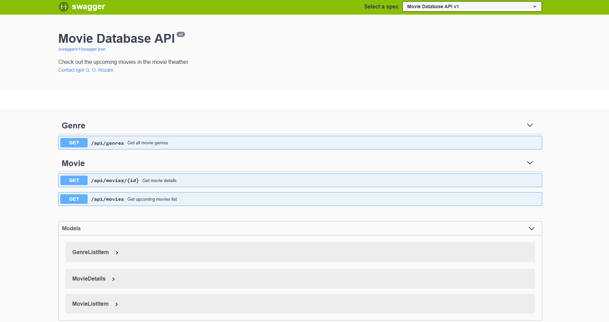
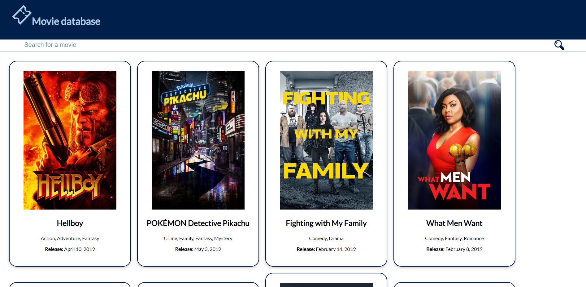
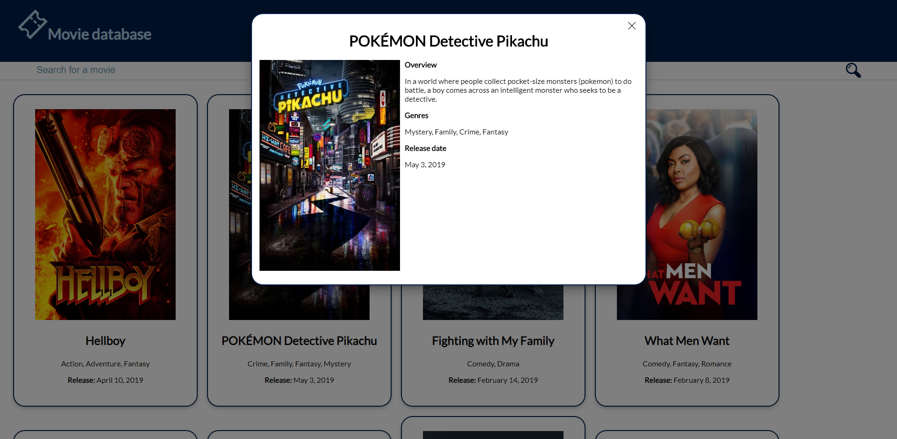

# Movie database
The project is sepate in two folders, "backend" that has the backend code and "frontend" that has the frontend code. I didn't know if i could separate it in two different repositories, so to not risk it, i decided to separate only in folders.

## Summary
* [Backend](#backend)
    * [Backend architecture](#backend-architecture)
        * [MovieDatabase.Scraper](#moviedatabase.scraper)
        * [MovieDatabase.Repository](#moviedatabase.repository)
        * [MovieDatabase.API](#moviedatabase.api)
        * [MovieDatabase.RestClient](#moviedatabase.restclient)
        * [MovieDatabase.TMDBService](#moviedatabase.tmdbservice)
    * [Backend third-party libraries](#backend-third-party-libraries)
    * [Backend local build instructions](#backend-local-build-instructions)
* [Frontend](#frontend)
    * [Screenshots](#screenshots)
        * [List page](#list-page)
        * [Details page](#details-page)
    * [Frontend architecture](#frontend-architecture)
    * [Frontend third-party libraries](#frontend-third-party-libraries)
    * [Frontend build instructions](#frontend-build-instructions)

## Backend
The backend was created using C# and Asp.Net Core. 

I wasn't able to finish on time, so i only have the upcoming movie list and movie details api.

### Backend architecture
I decided to use an evolutionary architecture, i started the solution with only one project and started to develop separating by folders, as the projects was growing i was deciding to create the new projects. For every layer or class i'm using interfaces, so this way the classes don't depends of other classes and it is easier to evolve or change the implementations. I'm using the dependency injection standard from the .Net core.

The project has three projects:

#### MovieDatabase.Scraper
Console application responsible for retrieving all the data from the TMDB API and insert into the database. In case a deploy, this project should run once per day to update the database. It has two scrapers:
- GenreScraper: responsible for getting the data from Genres;
- MovieScraper: responsible for getting the data from UpcomingMovies.

#### MovieDatabase.Repository
This project is responsible for accessing the database, the database is MySql and teh acess is made by EntityFramework. The database has 3 tables: Movie, Genre and MovieGenre.

#### MovieDatabase.API
The web api project that has the rest enpoints. It has 3 endpoints:
- GET /api/movies - For getting the list of upcoming movies, you can filter the list by page, quantity items per page and by movie name (not implemented);
- GET /api/movies/{id} - For getting the movie details;
- GET /api/genres - For getting the genres list.
The API has a swagger documentation, you can access it by /swagger and see models and response details.




#### MovieDatabase.RestClient
This project is reponsible to realise the call and retrieve data from external rest apis. This project utilizes the third-party library [Flurl](https://flurl.dev/), so i created an abstraction to be used by other projects from the solution.

#### MovieDatabase.TMDBService
The project responsible for reading data and preparing the data from the TMDB api, it realises the call in the following api:
- GET /configuration - To retrieve data to create the image path;
- GET /genre/movie/list - To retrieve data from all genres;
- GET /movie/upcoming - To retrieve the upcoming movie list;
- GET /movie/{id} - To retrieve the movie details.
This project depends of a section in the appsettings.json to get the data from the api address, api_key and other configurations.

### Backend third-party libraries
- [Flurl](https://flurl.dev/) - Utilized to get the data from the TMDB API;
- [Swashbuckle.AspNetCore](https://github.com/domaindrivendev/Swashbuckle.AspNetCore) - Utilized to documentate API with swagger;
- [Newtonsoft.Json](https://www.newtonsoft.com/json) - Utilized to manipulate json;
- [AutoMapper](https://automapper.org/) - Utilized to convert and map objects;
- [Pomelo.EntityFrameworkCore.MySql](https://github.com/PomeloFoundation/Pomelo.EntityFrameworkCore.MySql) - Entity Framework for MySql.

### Backend local build instructions
To run the project, it's necessary to start the MySql Docker Container:
- Access the root project folder and run the command ``` docker-componse up ```
- Open the backend project on Visual Studio 2019
- Run the database migration command ``` Update-database ```
- Run the project [MovieDatabase.Scraper](#moviedatabase.scraper)
- Run the project [MovieDatabase.API](#moviedatabase.api)

## Frontend
The frontend was created using Angular.

### Screenshots

#### List page


#### Details page


### Frontend architecture
The project is separeted by contexts, so i created a movie folder to group all the movie components, so inside it has a subdivision for the components, models and services folders.

For style, i decided to not use any css framework and created a simple and clean css by myself, and i based the site colors in the [Beautiful Blues Color Palette](https://www.color-hex.com/color-palette/1294).

### Frontend third-party libraries
- [ngx-infinite-scroll](https://www.npmjs.com/package/ngx-infinite-scroll) - Infinite scroll in the list;
- [ngx-smart-modal](https://www.npmjs.com/package/ngx-smart-modal) - For the details modal.

### Frontend build instructions
To run the projects local, it's necessary to use a proxy to call the local endpoints:
```
ng serve --proxy-config proxy.config.js
```
